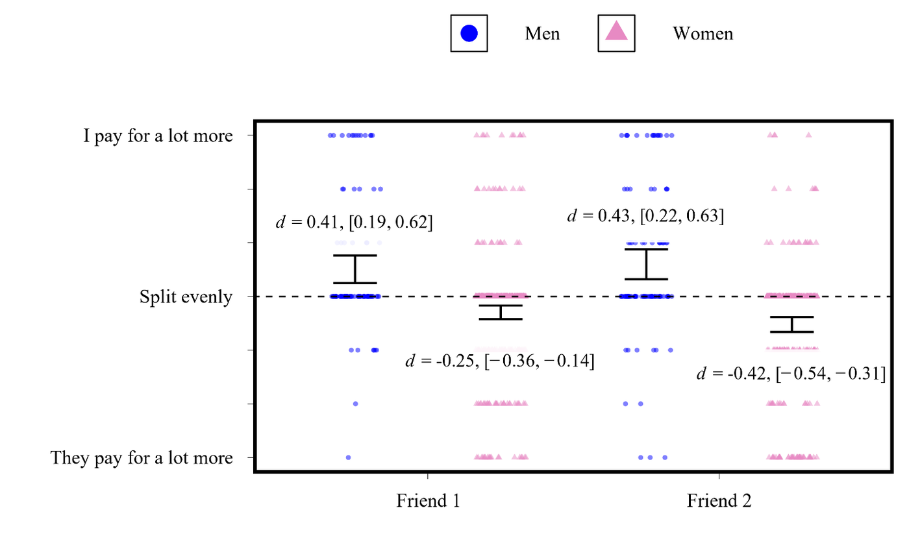
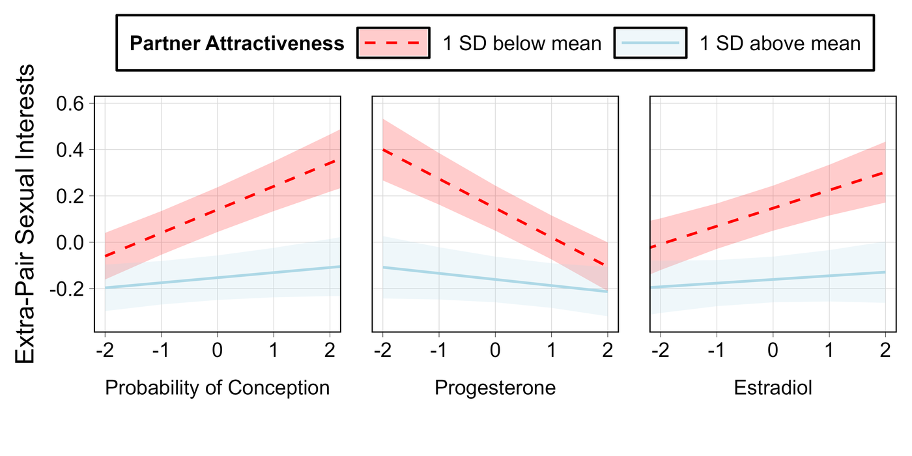
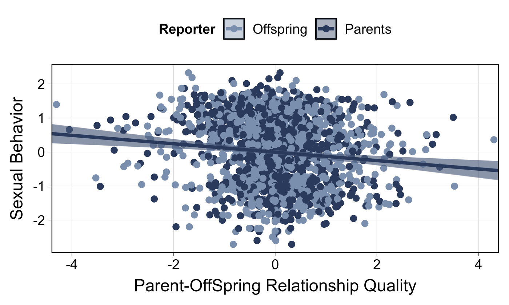
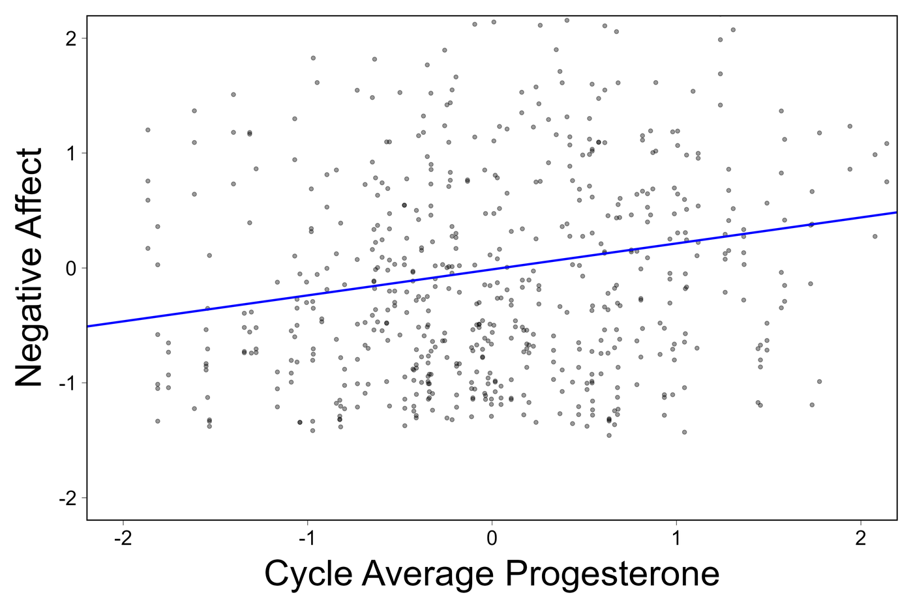
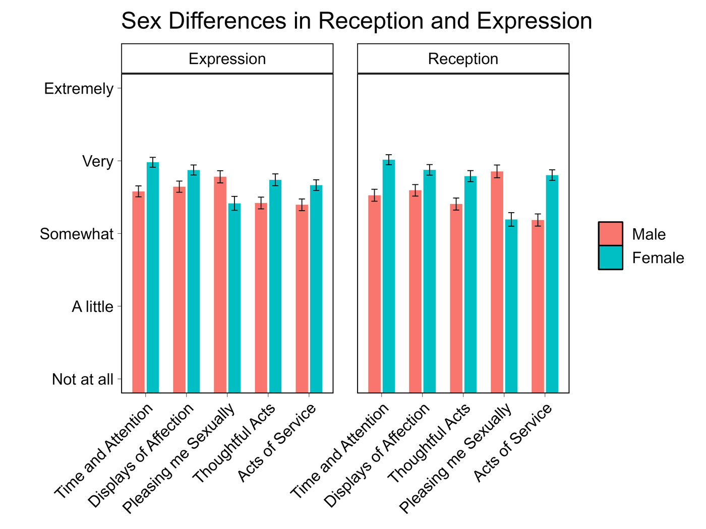

::: {.band .band-dark .band-tight}
::: {.wrap-narrow}
[Papers]{.eyebrow}

## Manuscripts and downloads {.section-title}

::: {.section-intro}
These are final submitted drafts rather than publisher proofs, so formatting
and pagination will differ from the version of record. Each entry includes a
short overview, the full abstract, and any conference talks or posters given
on the work. Happy to talk about any of this —
[rdobson@unm.edu](mailto:rdobson@unm.edu).
:::
:::
:::

::: {.band}
::: {.wrap}

<!-- ------------------------------------------------------------------ -->

::: {.paper}

::: {.paper-figure}
{fig-alt="Dot plot comparing how much men and women report paying for shared bills with two cross-sex friends. Men report paying for more; women report their friends pay for more."}

Men report paying for more of the bills shared with cross-sex friends than
women do, across two separate friendships.
:::

::: {.paper-body}
::: {.paper-meta}
[2026]{.paper-year}
[Manuscript]{.paper-status}
:::

### Courtship in Cross-Sex Friendship: Novel Tests of Male Financial Provisioning as a Signal and Cue of Mating Interest

::: {.paper-authors}
[Ryan Dobson]{.me}\*, William Costello\*, & David M. G. Lewis — \*shared first authorship
:::

::: {.paper-overview}
Tests whether men's financial provisioning functions as a courtship behavior
in cross-sex friendships. Across reports from men (*N* = 147) and women
(*N* = 441), it did — but as a stable difference between men rather than
something individual men vary across their friendships.
:::

Full abstract

Cross-sex friendships are often characterized by psychological and behavioral
patterns consistent with underlying mating motivations, and many romantic
relationships begin as friendships. Despite the prevalence of mating outcomes
in cross-sex friendships, little is known about the courtship behaviors in
cross-sex friendships that translate into these outcomes. Guided by parental
investment theory, sexual economics theory, and the principle that courtship
behaviors are calibrated to the mate preferences of the courted sex, we
elaborated and tested multiple novel predictions about a candidate courtship
behavior in cross-sex friendships: financial provisioning. Findings provided
robust support for half a dozen sex-differentiated predictions. First, men
(*N* = 147) reported that they pay for more of bills shared with cross-sex
friends, a perspective corroborated by reports from women (*N* = 441). Second,
men's, but not women's, interest in mating with their cross-sex friends
predicted their financial provisioning behavior. Third, women, but not men,
perceived cross-sex friends who financial provision them to be more interested
in mating with them. Notably, all these findings were explained as
between-person differences rather than within-person effects. That is, men did
not provision some female friends more than others depending on their
attraction to those specific friends. Rather, some men consistently provisioned
across their cross-sex friendships, whereas others did not. This pattern
suggests that some men are inclined to view cross-sex friendships as mating
opportunities whereas others do not, which may help explain some of the
variation in platonic versus mating outcomes of cross-sex friendships.
Collectively, these findings offer multiple new insights into the psychology
underpinning cross-sex friendships.

::: {.paper-actions}
[Download PDF](files/papers/dobson-costello-lewis-2026-courtship-cross-sex-friendship.pdf){.btn-quiet}
:::

::: {.tags}
[Cross-sex friendship]{.tag}
[Courtship]{.tag}
[Mating psychology]{.tag}
:::
:::
:::

<!-- ------------------------------------------------------------------ -->

::: {.paper}

::: {.paper-figure}
{fig-alt="Three panels showing extra-pair sexual interest plotted against probability of conception, progesterone, and estradiol, split by partner attractiveness. Effects appear for women with less attractive partners but not more attractive partners."}

Extra-pair sexual interest shifts with conception probability, progesterone,
and estradiol — but only among women with less attractive partners.
:::

::: {.paper-body}
::: {.paper-meta}
[2026]{.paper-year}
[Manuscript]{.paper-status}
:::

### Moderation of Ovulatory Cycle Shifts in Women's Extra-Pair Sexual Interests by Partner Sexual Attractiveness: Two Preregistered Studies

::: {.paper-authors}
[Ryan T. Dobson]{.me}, Tran Dinh, & Steven W. Gangestad
:::

::: {.paper-overview}
Two preregistered daily-diary studies (total *N* = 484, 30 days each) testing a
contested finding: that cycle shifts in women's interest in men other than
their partner depend on how attractive that partner is. The moderation
replicated robustly.
:::

Full abstract

For decades, researchers have sought to understand how women's sexual
psychology shifts across the menstrual cycle, from conceptive status to
non-conceptive status, likely under hormonal influence of estradiol and
progesterone. One key finding pertains to partnered women: A moderating
influence of male partners' sexual attractiveness on the association between
conceptive status and women's extra-pair sexual interests (attraction to men
other than primary partners). Women partnered with relatively unattractive
partners purportedly experience, on average, increased sexual interest in
extra-pair men when conceptive in their cycles, compared to non-conceptive
phases; women partnered with attractive men do not experience similar
increases. A number of studies have found evidence for this association, though
recent large-scale studies have yielded mixed and inconclusive evidence. More
conclusive research has been needed. In the current two studies, total *N* =
484, naturally cycling women reported their sexual interests daily for 30 days.
Analyses yield highly robust partner attractiveness moderation of the
association between conceptive status and extra-pair sexual interest.
Subsequent analyses support a role for both (imputed via a backward counting
method) estradiol and progesterone. These findings have major implications for
an understanding of how women's sexual psychology shifts across the cycle.

::: {.paper-actions}
[Download PDF](files/papers/dobson-dinh-gangestad-2026-ovulatory-extra-pair-interests.pdf){.btn-quiet}
:::

::: {.paper-extras}
[Presented as]{.extras-label}

::: {.extras-list}
[[Talk]{.extra-kind}NEEPS 2026](files/talks/dobson-2026-ovulatory-extra-pair-talk-neeps.pdf){.extra-link}
:::
:::

::: {.tags}
[Ovulatory cycle]{.tag}
[Preregistered]{.tag}
[Intensive longitudinal]{.tag}
:::
:::
:::

<!-- ------------------------------------------------------------------ -->

::: {.paper}

::: {.paper-figure}
{fig-alt="Scatter plot of sexual behavior against parent-offspring relationship quality, with separate fitted lines for offspring-reported and parent-reported relationship quality. Both slope downward."}

Higher parent-offspring relationship quality predicts lower-risk sexual
behavior, and the association holds whether parents or offspring rated the
relationship.
:::

::: {.paper-body}
::: {.paper-meta}
[2026]{.paper-year}
[Manuscript]{.paper-status}
:::

### Higher quality parent-offspring relationships predict lower-risk adolescent sexual behavior: A genetically informed sibling comparison

::: {.paper-authors}
[Ryan T. Dobson]{.me}, Tobias Edwards, Alexandros Giannelis, Geoffrey F. Miller,
Magdalena J. March, Emily A. Willoughby, Robert F. Krueger, Glenn I. Roisman,
& Matt McGue
:::

::: {.paper-overview}
Uses 617 two-offspring families — adoptive and non-adoptive — to ask whether
the link between parent-offspring relationship quality and adolescent sexual
behavior survives genetic confounding. It does, holding both between and
within families.
:::

Full abstract

**Purpose:** We used data from adopted and non-adopted siblings to separate
genetic and environmental confounding of the effect of parent-offspring
relationships on offspring's risky sexual behavior.

**Methods:** Data came from the Sibling and Interaction Behavior Study (SIBS),
which included 617 two-offspring families enrolled between 1998 and 2004 (53%
European, 39% Korean, 8% other), with either one or two adopted offspring
(*n* = 409) or two non-adopted offspring (*n* = 208). At one assessment
(*M* age = 17.3), parents and offspring reported on parent-offspring
relationship quality; at a later assessment (*M* age = 20.7), offspring
reported their sexual behavior. Univariate biometric models tested shared
environmental effects and mixed-effects models examined between- and
within-family effects.

**Results:** Biometric modeling indicated that 15% of the variance in sexual
behavior reflected shared environmental effects. Prospectively assessed
parent-offspring relationship quality was significantly associated with
offspring sexual behavior in both non-adopted and adopted families, eliminating
the possibility of genetic confounding, and within as well as between families,
consistent with a causal effect. Results were similar across both parent and
offspring ratings of relationship quality.

**Discussion:** We found consistent evidence for an environmental explanation:
higher quality parent-offspring relationships predicted that offspring were
less likely to engage in risky sexual behavior. These associations existed both
between families, reflecting the impact of shared environmental factors, and
within families, consistent with environmental influences that operate within
families. Future research should use research designs that separate potential
confounding from reactive gene-environment correlation and identify mechanisms
underlying this association to inform interventions.

::: {.paper-actions}
[Download PDF](files/papers/dobson-etal-2026-parent-offspring-adolescent-sexual-behavior.pdf){.btn-quiet}
:::

::: {.paper-extras}
[Presented as]{.extras-label}

::: {.extras-list}
[[Talk]{.extra-kind}BGA 2026](files/talks/dobson-2026-parent-offspring-talk-bga.pdf){.extra-link}
[[Talk]{.extra-kind}HBES 2026](files/talks/dobson-2026-parent-offspring-talk-hbes.pdf){.extra-link}
:::
:::

::: {.tags}
[Behavior genetics]{.tag}
[Adoption design]{.tag}
[Sexual development]{.tag}
:::
:::
:::

<!-- ------------------------------------------------------------------ -->

::: {.paper}

::: {.paper-figure}
{fig-alt="Scatter plot of negative affect against cycle average progesterone with an upward-sloping fitted line, showing the between-women association."}

Women with higher cycle-average progesterone reported more negative affect —
a between-women association, not a within-woman one.
:::

::: {.paper-body}
::: {.paper-meta}
[2026]{.paper-year}
[Manuscript]{.paper-status}
:::

### Progesterone and Negative Emotionality Across and Between Ovulatory Cycles: A Study of Romantically Involved Women

::: {.paper-authors}
[Ryan T. Dobson]{.me}, Tran Dinh, Tania A. Reynolds, Melissa Emery Thompson,
& Steven W. Gangestad
:::

::: {.paper-overview}
Partnered women (*N* = 180) across up to four in-lab sessions with assayed
hormones. Women's average progesterone predicted negative emotionality, but
their own session-to-session shifts did not — which is hard to square with
progesterone causing the effect.
:::

Full abstract

In prior work, naturally cycling women's progesterone levels were found to be
associated with their anxiety levels and concerns about levels of social
support. The current study further examined these associations. Naturally
cycling partnered women (*N* = 180) participated in up to four in-lab sessions
across a month. Each session, they filled out measures of their mood states and
their concerns about investment by their primary relationship partners.
Progesterone, estradiol, testosterone, and cortisol levels were assayed in
session-specific urine samples. In mixed model analyses, both average levels of
hormones and within-woman variations of hormones were entered as predictors of
negative emotionality and concerns about partner investment. Women's mean
levels of progesterone positively predicted these outcomes, but their
session-specific variations in progesterone were weakly and not significantly
associated with these outcomes. Mean estradiol levels negatively and mean
testosterone levels positively predicted negative emotionality. Only
within-woman variations in cortisol levels predicted negative emotionality. In
additional analyses, both mean follicular and luteal phase levels of
progesterone predicted negative emotionality. Overall, results are not
consistent with progesterone affecting negative emotionality. Perhaps negative
emotionality influences progesterone levels, though additional research is
needed before definitive causal conclusions can be offered.

::: {.paper-actions}
[Download PDF](files/papers/dobson-etal-2026-progesterone-negative-emotionality.pdf){.btn-quiet}
:::

::: {.paper-extras}
[Presented as]{.extras-label}

::: {.extras-list}
[[Talk]{.extra-kind}HBES 2025](files/talks/dobson-2025-progesterone-emotionality-talk-hbes.pdf){.extra-link}
[[Talk]{.extra-kind}SPSP 2025](files/talks/dobson-2025-progesterone-emotionality-talk-spsp.pdf){.extra-link}
:::
:::

::: {.tags}
[Hormones]{.tag}
[Ovulatory cycle]{.tag}
[Emotion]{.tag}
:::
:::
:::

<!-- ------------------------------------------------------------------ -->

::: {.paper}
::: {.paper-body}
::: {.paper-meta}
[2026]{.paper-year}
[Manuscript]{.paper-status}
:::

### Considering the Evolutionary Benefits and Costs of Friendship Networks

::: {.paper-authors}
Grace Vieth, [Ryan T. Dobson]{.me}, Jeffrey Simpson, & Steven W. Gangestad
:::

::: {.paper-overview}
A conceptual paper on the adaptive problems created by having several friends
at once. Adding a friend can raise your total benefit while making each
existing friend more replaceable — which undercuts the irreplaceability that
sustains stake-based investment in the first place.
:::

Full abstract

Recent efforts have sought to redress the relative paucity of theoretical work
on the adaptive benefits that led friendships to be fundamentally important
close human relationships (e.g., viewing investment in them as stake-based).
Still, relatively little work has specifically addressed adaptations that
function to developing, maintaining, and regulating friendship networks,
generally consisting of multiple friends. This paper explores this domain.
Following other scholars, we observe that a key quality of friendships that
maintains stake-based investment in them is irreplaceability. Adding a friend
to one's friendship network may have marginal net benefits. Yet the added
friend may not only be less irreplaceable than others in the network; the added
friend may reduce the irreplaceability of other friends in the network, thereby
potentially weakening stake-based investment crucial to friendship. We discuss
multiple adaptive problems that arise and potential solutions to them,
suggestive of adaptations that people possess for the function of developing,
maintaining, and regulating friendship networks. Future directions for
potentially fruitful conceptual and empirical exploration are discussed, as are
potential domains of application to understanding friendship more broadly.

::: {.paper-actions}
[Download PDF](files/papers/vieth-dobson-simpson-gangestad-2026-friendship-networks.pdf){.btn-quiet}
:::

::: {.tags}
[Friendship]{.tag}
[Fitness interdependence]{.tag}
[Theory]{.tag}
:::
:::
:::

<!-- ------------------------------------------------------------------ -->

::: {.paper}

::: {.paper-figure}
{fig-alt="Grouped bar chart of mean ratings for five love languages, split by sex, shown separately for expression and reception. Women rate every love language higher than men except pleasing me sexually, where men rate higher."}

Women rated every love language higher than men did — except *pleasing me
sexually*, the only one men rated higher, in both the expression and reception
formats.
:::

::: {.paper-body}
::: {.paper-meta}
[2024]{.paper-year}
[M.S. Thesis · University of New Mexico]{.paper-status .is-published}
:::

### Psychometric Exploration of the Five Love Languages

::: {.paper-authors}
[Ryan T. Dobson]{.me} — Committee: Geoffrey Miller (chair), Tania Reynolds,
Margo Hurlocker, David Lewis
:::

::: {.paper-overview}
A factor-analytic test of whether Gary Chapman's five love languages hold up as
a measurement model (*n* = 740). Exploratory analyses suggested two- and
five-factor solutions were reasonable; no confirmatory model was retained.
:::

Full abstract

Gary Chapman's *The 5 Love Languages* (2024) is an internationally recognized
popular psychology theory. In the present study (*n* = 740) a series of factor
analyses were conducted to explore the structure of the five love languages.
Both the structure of what behaviors people perceive as an expression of their
partner's love (reception), and the structure of what behaviors people perceive
as an expression of their love for their partner (expression) were examined.
Although exploratory factor analyses suggested that a two-factor and
five-factor solution were reasonable across both reception and expression
formats, confirmatory factor analyses resulted in no model being retained. A
detailed overview of the analyses in relation to construct validity provides a
clear path for future research to clarify the structure of the love languages.
In addition, I discuss what researchers studying the love languages should aim
to do and how they might best achieve those aims.

::: {.paper-actions}
[Download PDF](files/papers/dobson-2024-five-love-languages-thesis.pdf){.btn-quiet}
:::

::: {.paper-extras}
[Presented as]{.extras-label}

::: {.extras-list}
[[Poster]{.extra-kind .is-poster}SPSP 2025](files/posters/dobson-2025-five-love-languages-poster-spsp.pdf){.extra-link}
[[Lecture]{.extra-kind .is-lecture}Guest lecture](files/talks/dobson-2025-five-love-languages-guest-lecture.pdf){.extra-link}
:::
:::

::: {.tags}
[Psychometrics]{.tag}
[Factor analysis]{.tag}
[Relationships]{.tag}
:::
:::
:::

<!-- ------------------------------------------------------------------ -->

::: {.paper}
::: {.paper-body}
::: {.paper-meta}
[2022]{.paper-year}
[Honors Thesis · UW–Eau Claire]{.paper-status .is-published}
:::

### Jealousy in Opposite-Sex Friendships: The Threat of Being Replaced

::: {.paper-authors}
[Ryan T. Dobson]{.me} — Committee: April Bleske-Rechek (Psychology),
Kristin Schaupp (Philosophy)
:::

::: {.paper-overview}
My undergraduate honors thesis. Asks who you feel most threatened by when your
closest opposite-sex friend forms a new relationship (*n* = 158). A same-sex
friend interloper provoked the least jealousy — but, contrary to prediction,
men and women reacted alike.
:::

Full abstract

When people are asked to imagine the loss of their best same-sex friend, a
same-sex interloper (versus an opposite-sex friend interloper or romantic
partner interloper) elicits the most jealousy (Krems et al., 2021). In the
context of being asked to imagine their best opposite-sex friend starting three
new types of relationships (same-sex friendship, opposite-sex friendship,
romantic relationship), I predicted that a same-sex friend interloper would
elicit less jealousy than an opposite-sex friend interloper or romantic partner
interloper would, because opposite-sex friends can serve as friends or
potential romantic partners. In addition, because men (compared to women) are
more likely to perceive their opposite-sex friend as a potential sexual partner
and women (compared to men) are more likely to perceive their opposite-sex
friend as a platonic friend. I predicted that men would be more jealous of the
romantic partner interloper than women, and women would be more jealous of the
opposite-sex friend interloper than men. In the current study (*n* = 158, 51%
female), I found that when participants are asked to imagine a best
opposite-sex friend starting new relationships, a same-sex friend interloper
evoked less jealousy than an opposite-sex friend interloper or romantic partner
interloper did. Contrary to expectations men and women were similarly jealous
of the opposite-sex friend interloper and romantic partner interloper. One
direction for future research is to separate romantic jealousy from friendship
jealousy in the opposite-sex friendship context.

::: {.paper-actions}
[Download PDF](files/papers/dobson-2022-jealousy-opposite-sex-friendships-honors-thesis.pdf){.btn-quiet}
:::

::: {.tags}
[Jealousy]{.tag}
[Opposite-sex friendship]{.tag}
[Undergraduate]{.tag}
:::
:::
:::

:::
:::

<!-- ================================================================== -->

::: {.band .band-cream}
::: {.wrap}
[Additional work]{.eyebrow}

## Talks and posters without a manuscript {.section-title}

::: {.section-intro}
Work I have presented at conferences that has not been written up as a
manuscript. Happy to share data or discuss any of it.
:::

::: {.card-grid .grid-2}

::: {.c-card}
[Talk · NEEPS 2025]{.c-card-num}

### Toward an Evolutionary Informed Understanding of Cross-Sex Friendships

A theoretical talk on whether platonic cross-sex friendships solved recurrent
adaptive problems, drawing on comparative evidence from other primates.

[Download slides](files/talks/dobson-2025-cross-sex-friendships-talk-neeps.pdf){.btn-quiet}
:::

::: {.c-card}
[Poster · HBES 2024]{.c-card-num}

### The Evolutionary Psychology of BDSM

Insights from a factor-analytic study of 136 sexual kinks in 33,668 adults.

[Download poster](files/posters/dobson-2024-bdsm-sexual-kinks-poster-hbes.pdf){.btn-quiet}
:::

::: {.c-card}
[Poster · HBES 2024]{.c-card-num}

### Women and men, harm and censoriousness

Sex-differentiated reactions to information about sex differences.
With Parker Lay.

[Download poster](files/posters/dobson-2024-sex-differences-censoriousness-poster-hbes.pdf){.btn-quiet}
:::

::: {.c-card}
[Poster · ISIR 2025]{.c-card-num}

### Specific Cognitive Abilities Predict Socio-Political Attitudes Above and Beyond *g*

With Tobias Edwards.

[Download poster](files/posters/dobson-2025-cognitive-abilities-political-attitudes-poster-isir.pdf){.btn-quiet}
:::

:::
:::
:::
